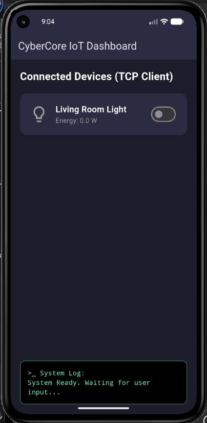

# CyberCore Smart Home IoT Controller

This project presents a foundational Smart Home IoT system, demonstrating a robust client-server architecture built with a C++ backend and a Flutter frontend. It showcases secure communication, device management, and the application of the Command design pattern for flexible device control.

## ✨ Features

*   **TCP/IP Communication:** Establishes a reliable connection between the C++ server (hub) and the Flutter client (dashboard).
*   **Command Pattern Implementation:** Decouples device actions (commands) from the system controller (invoker), making the system highly extensible for new device types and operations.
*   **Smart Device Control:** Currently supports toggling Smart Lights (e.g., "Living Room Light") on/off.
*   **Real-time Status & Energy Monitoring:** Provides instant feedback on device status (`ON`/`OFF`) and simulated energy consumption directly on the Flutter dashboard.
*   **Interactive 2D Home Grid:** Displays a textual 2D grid of connected devices and their states, visible on both the C++ server console and integrated into the Flutter client's terminal log.
*   **Admin Authentication:** Secures server access with a simple password-based login mechanism.
*   **Graceful Server Shutdown:** Allows for a controlled termination of the C++ server via a specific command.
*   **Cross-Platform Frontend:** Utilizes Flutter for a modern, dark-themed user interface that can run on various mobile platforms (Android, iOS).

## 🚀 Architecture & Design Patterns

The project is structured around a classic client-server model, with a key emphasis on the **Command Design Pattern** within the C++ backend.

### C++ Backend (Server)

*   **Device Abstraction:** An abstract `Device` class defines common interfaces (`toggleStatus`, `calculateEnergy`), allowing for easy extension to various IoT devices. `SmartLight` is a concrete implementation.
*   **Command Pattern:**
    *   `Command` (abstract base class): Defines the `execute()` interface for all commands.
    *   `ToggleCommand`: A concrete command that encapsulates the action of toggling a `Device`.
    *   `ExitCommand`: A concrete command to gracefully shut down the server.
    *   **Home (Invoker):** Acts as the central controller, managing `Device` objects and dispatching `Command` execution based on client requests.
*   **TCP/IP Server:** Implemented using `Winsock2` on Windows, listening for incoming client connections and processing commands sent over the network.

### Flutter Frontend (Client)

*   **TCP/IP Client:** Connects to the C++ server over a specified IP and port (10.0.2.2:8080 for Android emulator).
*   **Payload Parsing Engine:** A robust mechanism to parse combined responses from the server, extracting device status, energy data, and the 2D home grid string.
*   **Reactive UI:** Built with Flutter, the UI dynamically updates based on responses received from the server, reflecting device states and system logs.

## 🛠️ Technologies Used

*   **Backend:**
    *   C++
    *   Winsock2 (for Windows TCP/IP networking)
*   **Frontend:**
    *   Flutter SDK
    *   Dart

## ⚙️ Setup and Installation

Follow these steps to set up and run both the C++ server and the Flutter client.

### 1. C++ Backend (Server)

**Prerequisites:**

*   A C++ compiler, preferably MSVC (Visual Studio) on Windows due to `Winsock2` dependencies.

**Build and Run:**

1.  **Navigate:** Open your terminal or command prompt and go to the directory containing `main.cpp`.
2.  **Compile:** Use a C++ compiler to compile `main.cpp`.
    *   **Using g++ (MinGW/WSL - may require linking `ws2_32` explicitly if available, otherwise recommend MSVC):**
        ```bash
        g++ main.cpp -o iot_server.exe -lws2_32
        ```
    *   **Using MSVC (Visual Studio Command Prompt):**
        ```bash
        cl main.cpp ws2_32.lib
        ```
        This will generate `main.exe` (or `iot_server.exe` if you specify `-Feiot_server.exe`).
3.  **Run:** Execute the compiled program.
    ```bash
    ./iot_server.exe
    ```
4.  **Login:** The server will prompt for an administrator password. Enter `admin123`.
    *   The server will then initialize devices and start listening on `PORT 8080`.

### 2. Flutter Frontend (Client)

**Prerequisites:**

*   Flutter SDK installed and configured.
*   An IDE like VS Code or Android Studio with Flutter/Dart plugins.
*   An Android emulator or a physical Android device.

**Setup and Run:**

1.  **Navigate:** Open your terminal or command prompt and go to the `smarthome` directory within the project root.
2.  **Get Dependencies:** Fetch all necessary Flutter packages.
    ```bash
    flutter pub get
    ```
3.  **Run the App:** Launch the Flutter application on your chosen device/emulator.
    ```bash
    flutter run
    ```
    *   **Important for Android Emulators:** The Flutter client connects to `10.0.2.2:8080`. This IP address `10.0.2.2` is a special alias in Android emulators to access `localhost` (your development machine). Ensure your C++ server is running on `localhost` (your machine's actual IP is not needed here if using the emulator alias).

## 🚀 Usage

1.  **Start the C++ Server:** Follow the "Setup and Installation" steps to compile and run `iot_server.exe`. Log in with `admin123`. Observe the initial 2D grid on the server console.
2.  **Launch the Flutter App:** Run the Flutter application on an emulator or device. The "CyberCore IoT Dashboard" will appear.
3.  **Control Device:**
    *   Locate the "Living Room Light" card on the dashboard.
    *   Toggle the switch next to it.
4.  **Observe Changes:**
    *   The light icon and the energy consumption (`W`) on the Flutter dashboard will update instantly.
    *   The "System Log" at the bottom of the Flutter app will show network communication status and the live 2D grid update received from the server.
    *   The C++ server console will also print its updated 2D grid.

To shut down the C++ server, you can currently close its console window. In a future enhancement, a client command could be implemented for a more controlled shutdown.

## 📸 Screenshots

<div align="center">
  <table style="border: none; border-collapse: collapse;">
    <tr>
      <td align="center" style="border: none;">
        
        <br /><br /><sub><strong>Screenshot 1</strong></sub>
      </td>
    </tr>
  </table>
</div>

## 💡 Future Enhancements

*   **Expanded Device Support:** Implement additional device types (e.g., SmartThermostat, SmartDoorLock) using the existing `Device` abstraction.
*   **Robust Command Parsing:** Enhance the C++ server to parse commands with arguments (e.g., `TOGGLE_LIGHT 101` to target specific devices by ID).
*   **Multiple Device Control:** Allow the Flutter app to list and control all devices present in the `Home` controller.
*   **Persistent State:** Implement a mechanism to save and load device states (e.g., to a file or database) so they persist across server restarts.
*   **Secure Communication:** Integrate TLS/SSL for encrypted communication between the client and server.
*   **Error Handling & Logging:** More comprehensive error handling and detailed logging for debugging and monitoring.
*   **Client-side "EXIT" Command:** Add a button or command in the Flutter app to send the "EXIT" command to the server for a controlled shutdown.
*   **User Interface Improvements:** Enhance the Flutter UI with device-specific controls, scheduling options, and more detailed device information.